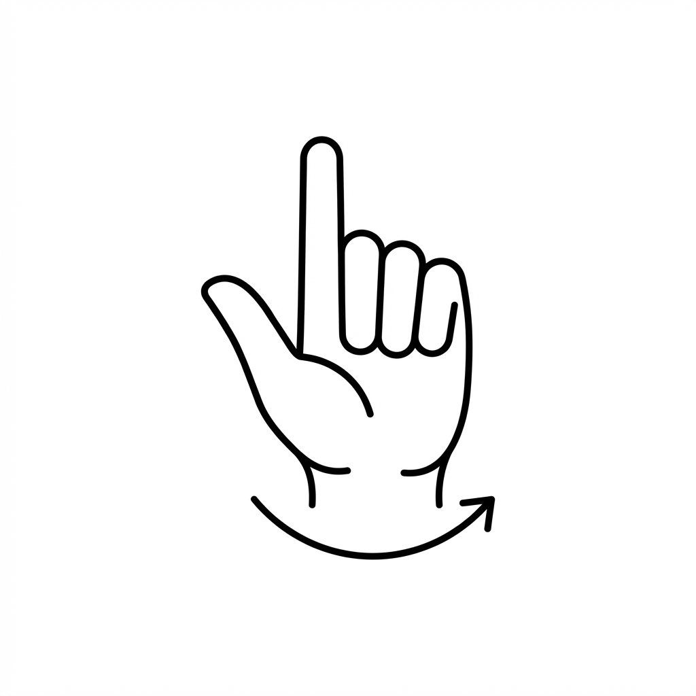
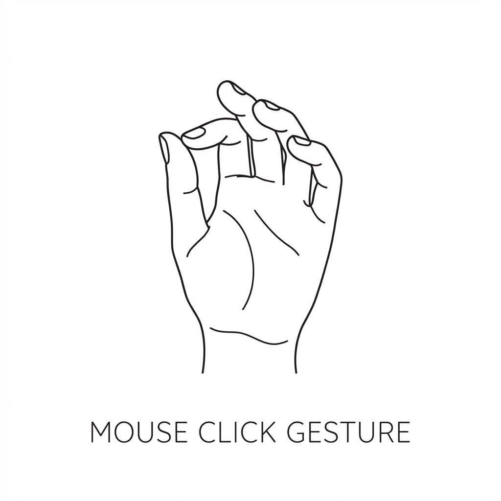
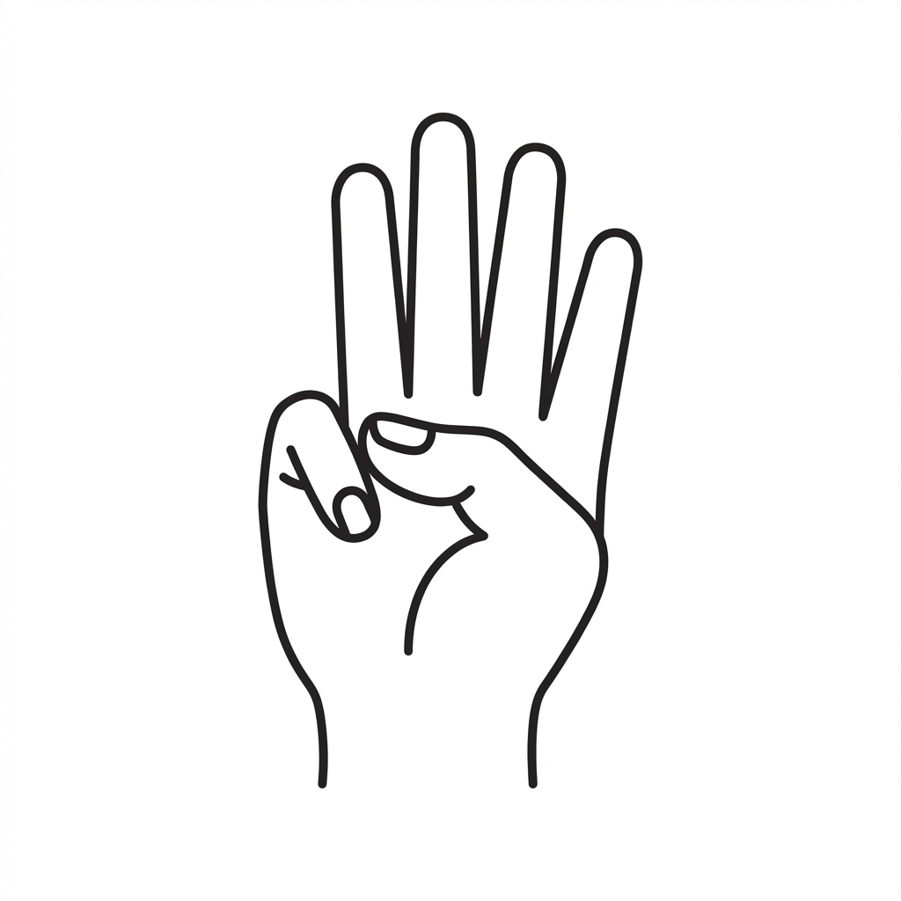
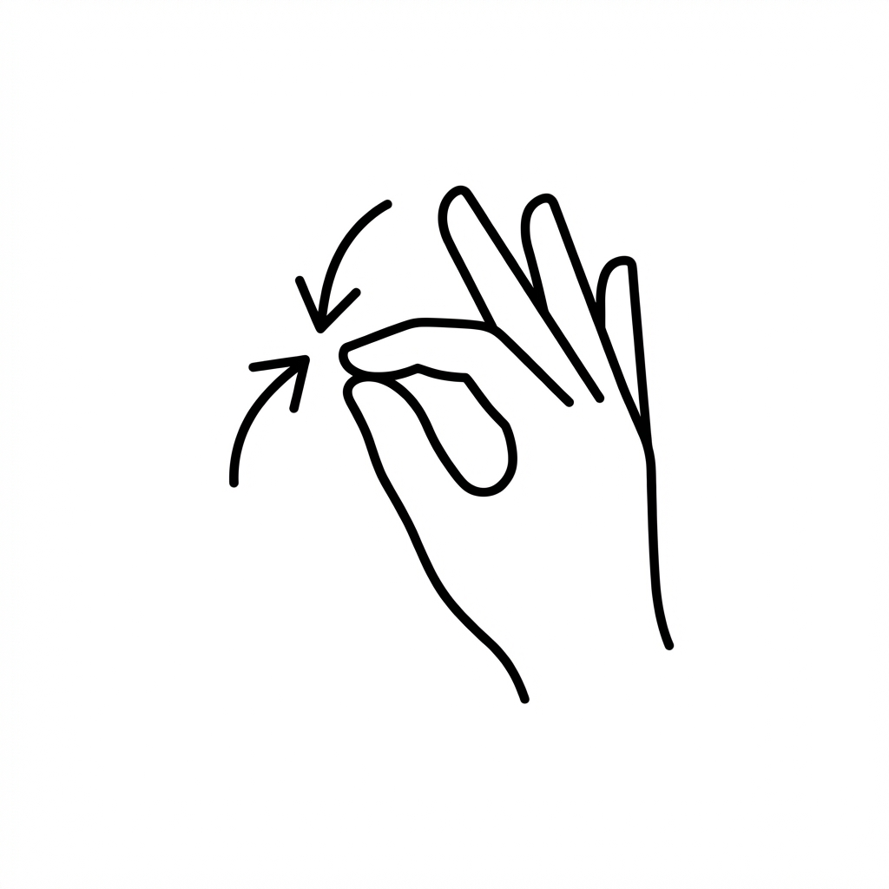

# 🖐️ NonMouse Hand Gesture Guide

## Quick Reference

| Gesture | Action | Visual Indicator |
|---------|--------|------------------|
| ☝️ Index finger | Move cursor | 🔵 Blue dot |
| ✌️ Index + Middle touch | Stop cursor | No dot |
| 👍 Thumb to index joint | Left Click | 🟡 Yellow circle |
| ✊ Hold click 1.5s | Right Click | 🔴 Red circle |
| 👆 Fold index finger | Scroll | ⚫ Black circle |
| 🤏 Pinch thumb + index | Zoom Out | 🟣 Purple circle |
| 🖐️ Spread thumb + index | Zoom In | 🟡 Cyan circle |

---

## Gesture Images

### Move Cursor

Point with index finger - cursor follows fingertip

---

### Left Click

Touch thumb to index finger's 2nd joint

---

### Scroll

Fold index finger down and move hand up/down

---

### Pinch Zoom

Pinch = Zoom Out | Spread = Zoom In

---

## Detailed Instructions

### 1. 🖱️ Move Cursor
- Extend your index finger straight
- Keep other fingers folded
- Move your hand to move cursor

### 2. ⏸️ Stop Cursor  
- Touch index + middle fingertips together
- Cursor freezes in place

### 3. 🖱️ Left Click
- Touch thumb tip to index finger's 2nd joint
- Quick touch = single click
- Two quick clicks = double click

### 4. 🖱️ Right Click
- Hold left click position for 1.5 seconds
- Don't move cursor while holding

### 5. 📜 Scroll
- Fold your index finger (curl it down)
- Move hand up/down to scroll
- **Momentum:** Quick swipe then release!

### 6. 🔍 Zoom In / 🔎 Zoom Out
- **Zoom In:** Spread thumb + index apart
- **Zoom Out:** Pinch thumb + index together

---

## 💡 Tips

1. **Good Lighting** - Keep your hand well-lit
2. **Steady Hand** - Keep hand parallel to camera
3. **Distance** - Not too close, not too far
4. **Caps Lock** - Toggle ON to activate tracking

## ⚙️ Sensitivity

- **Low (1-30):** Precise but slow
- **Medium (30-60):** Balanced
- **High (60-100):** Fast but may shake
